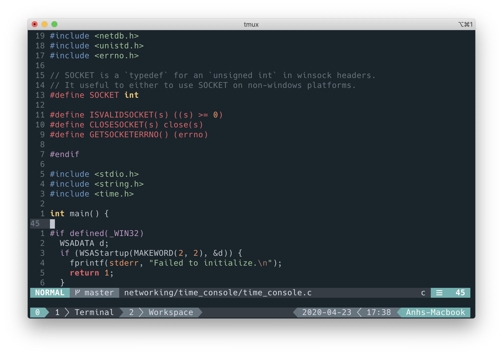

# dotfiles

This repository is the house of my lightweight development toolboxes and configurations. It is a powerful, minimalist development environment.

 
  

## Prerequisites

- Tmux
- ZSH
- Neovim
- Ripgrep
- FZF
- NERD Font ([https://github.com/ryanoasis/nerd-fonts](https://github.com/ryanoasis/nerd-fonts#font-installation))

## Installation

Clone this repository inside your home dictionary, and name it `.dotfiles` to make it invisible.

    git clone https://github.com/anhmv/dotfiles.git ~/.dotfiles

### ZSH

Backup your current ZSH configuration file, and create a symlink to the dotfiles.

    $ mv ~/.zshrc ~/.zshrc.bak
    $ ln -s ~/.dotfiles/zsh/zshrc ~/.zshrc

### TMUX

The same with the step above, we need to backup your configuration and replaced by the new one

    $ mv ~/.tmux.conf ~/.tmux.conf.bak
    $ ln -s ~/.dotfiles/tmux/tmux.conf ~/.tmux.conf

### NEOVIM

Back up your current Neovim configuration dictionary

    $ mv ~/.config/nvim ~/.config/nvim.back
    $ mkdir ~/.config/nvim

Symlinks

    $ ln -s ~/.dotfiles/nvim/init.vim ~/.config/nvim/init.vim

Start Neovim by enter the command `nvim` and install plugins

    :PlugInstall

### Nerd fonts

Please see the nerd fonts installation document.
